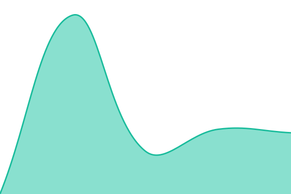
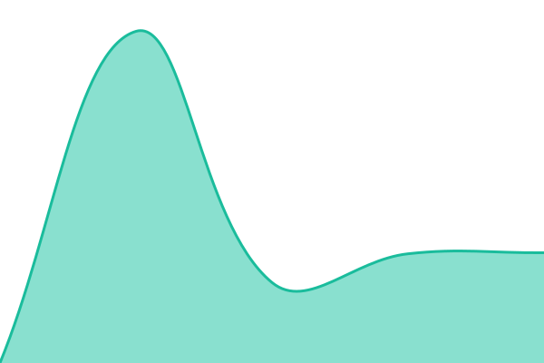
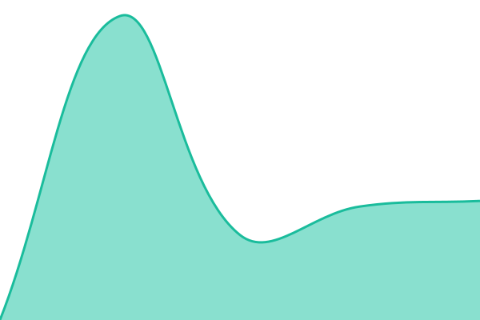
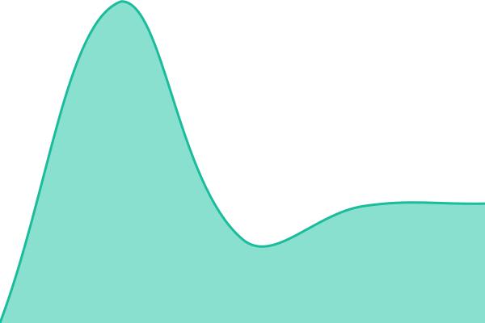

# [📈 Live Status](https://1kubisjosef-spec.github.io/hlidani-webu): <!--live status--> **🟩 All systems operational**

This repository contains the open-source uptime monitor and status page for [1kubisjosef-spec](https://1kubisjosef-spec.github.io/hlidani-webu), powered by [Upptime](https://github.com/upptime/upptime).

With [Upptime](https://upptime.js.org), you can get your own unlimited and free uptime monitor and status page, powered entirely by a GitHub repository. We use [Issues](https://github.com/1kubisjosef-spec/hlidani-webu/issues) as incident reports, [Actions](https://github.com/1kubisjosef-spec/hlidani-webu/actions) as uptime monitors, and [Pages](https://1kubisjosef-spec.github.io/hlidani-webu) for the status page.

<!--start: status pages-->
<!-- This summary is generated by Upptime (https://github.com/upptime/upptime) -->
<!-- Do not edit this manually, your changes will be overwritten -->
<!-- prettier-ignore -->
| URL | Status | History | Response Time | Uptime |
| --- | ------ | ------- | ------------- | ------ |
|  [Kubis Studio](https://kubisstudio.cz) | 🟩 Up | [kubis-studio.yml](https://github.com/1kubisjosef-spec/hlidani-webu/commits/HEAD/history/kubis-studio.yml) | 

 1649ms
     
 | 

<a href="https://1kubisjosef-spec.github.io/hlidani-webu/history/kubis-studio">100.00%</a>
    

|  [CleanPoint](https://clean-point.cz) | 🟩 Up | [clean-point.yml](https://github.com/1kubisjosef-spec/hlidani-webu/commits/HEAD/history/clean-point.yml) | 

 1427ms
     
 | 

<a href="https://1kubisjosef-spec.github.io/hlidani-webu/history/clean-point">100.00%</a>
    

|  [Nymburk s klidem](https://www.nymburksklidem.cz) | 🟩 Up | [nymburk-s-klidem.yml](https://github.com/1kubisjosef-spec/hlidani-webu/commits/HEAD/history/nymburk-s-klidem.yml) | 

 2473ms
     
 | 

<a href="https://1kubisjosef-spec.github.io/hlidani-webu/history/nymburk-s-klidem">100.00%</a>
    

|  [Chalupa Studce](https://nejlepsichalupa.cz) | 🟩 Up | [chalupa-studce.yml](https://github.com/1kubisjosef-spec/hlidani-webu/commits/HEAD/history/chalupa-studce.yml) | 

 1411ms
     
 | 

<a href="https://1kubisjosef-spec.github.io/hlidani-webu/history/chalupa-studce">100.00%</a>
    

|  [Nejlepsi zahrady](https://nejlepsizahrady.cz) | 🟩 Up | [nejlepsi-zahrady.yml](https://github.com/1kubisjosef-spec/hlidani-webu/commits/HEAD/history/nejlepsi-zahrady.yml) | 

 1399ms
     
 | 

<a href="https://1kubisjosef-spec.github.io/hlidani-webu/history/nejlepsi-zahrady">100.00%</a>
    

|  [Pavlina Vrabcova](https://pavlinavrabcovazafotakem.cz) | 🟩 Up | [pavlina-vrabcova.yml](https://github.com/1kubisjosef-spec/hlidani-webu/commits/HEAD/history/pavlina-vrabcova.yml) | 

 1222ms
     
 | 

<a href="https://1kubisjosef-spec.github.io/hlidani-webu/history/pavlina-vrabcova">100.00%</a>
    

<!--end: status pages-->

[**Visit our status website →**](https://1kubisjosef-spec.github.io/hlidani-webu)

## 📄 License

- Powered by: [Upptime](https://github.com/upptime/upptime)
- Code: [MIT](./LICENSE) © [Anand Chowdhary](https://anandchowdhary.com)
- Data in the `./history` directory: [Open Database License](https://opendatacommons.org/licenses/odbl/1-0/)
